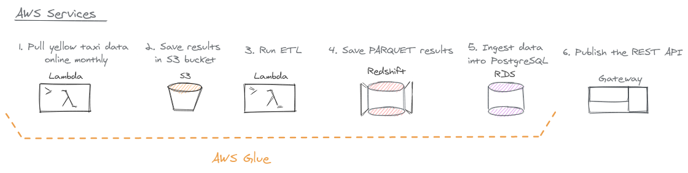

# NYC Taxi & Limousine Commission - yellow taxi trip records

The yellow taxi trip records include fields capturing pick-up and drop-off
dates/times, pick-up and drop-off locations, trip distances, itemized fares,
rate types, payment types, and driver-reported passenger counts.

### 1) Extract

Download the 2020 yellow taxi trip data from https://www1.nyc.gov/site/tlc/about/tlc-trip-record-data.page.

```bash
./download_data.sh
```

### 2) Transform

The parquet output files are generated with:
```bash
python transform_spark.py
```

### 3) Load

The parquet files are saved into the postgres database for the API consumption.
To setup the database server, please run:

```bash
docker-compose up -d postgres
# (optional) to access the interactive terminal:
# docker-compose exec postgres psql -U docker -d nyc_tlc
```

Then, import the parquet files into the database:

```bash
python parquet_to_postgres.py
```

### 4) Consume

Start the API server:

```bash
uvicorn app.main:app --reload
```

Send an example request:

```bash
curl http://localhost:8000/api/tip/2020/01/max
```

---


